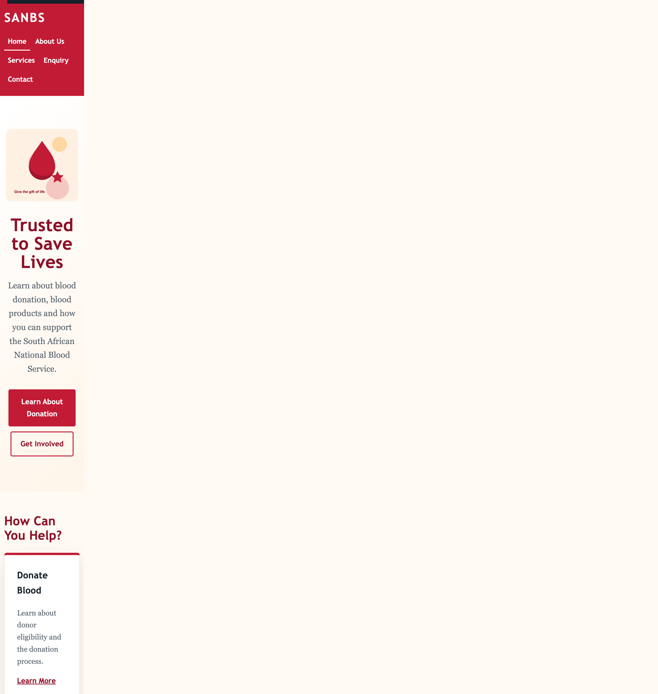
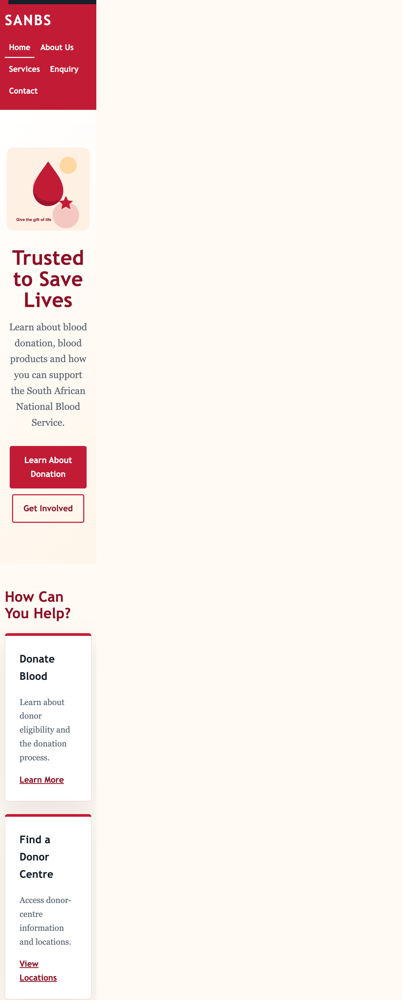
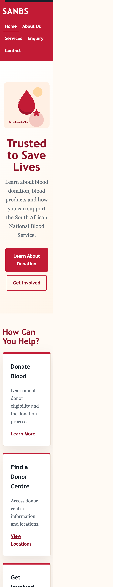

# South African National Blood Service (SANBS) Website

## Part 1 – Building the Foundation: Project Initiation and Planning

---

## Student Information

**Student Name:** Litha Mbawu  
**Student Number:** ST10486617
**Subject Name:** WEB DEVELOPMENT 
**Subject Code:** WEDE5020
 

---

# 1. Project Title

## South African National Blood Service (SANBS) Website Redesign

---

# 2. Project Overview

The purpose of this project is to develop a functional and visually appealing website prototype for the South African National Blood Service (SANBS).

SANBS is a non-profit organisation responsible for providing safe and quality blood and blood products to patients and healthcare facilities in South Africa.

The proposed website aims to make important information easier to find and improve the overall user experience for blood donors, healthcare professionals, community organisations and members of the public.

The website will provide information about SANBS, blood donation, blood products, donor services, contact locations and ways for members of the public and organisations to get involved.

This project is being developed as an academic prototype. Advanced functionality such as a secure donor portal, databases, real-time blood-stock APIs and online appointment systems may be considered as future development rather than requirements for Part 1.

---

# 3. Website Goals and Objectives

The main goals of the website are to:

- Increase awareness of blood donation.
- Encourage first-time and regular blood donors.
- Provide clear information about the blood donation process.
- Explain the different blood products and services provided by SANBS.
- Make contact and location information easier to access.
- Allow visitors to enquire about volunteering.
- Allow organisations to enquire about sponsorship and partnerships.
- Allow organisations to enquire about organising blood drives.
- Provide an easy-to-use navigation system.
- Provide a responsive and accessible website structure.

---

# 4. Key Performance Indicators (KPIs)

The success of the proposed website can be measured using the following indicators:

- Increase in website visitors.
- Increase in visits to the blood donation information page.
- Increase in donor-related enquiries.
- Increase in volunteer enquiries.
- Increase in sponsorship enquiries.
- Increase in blood-drive enquiries.
- Increase in visits to contact and donor-centre information.
- Improved user engagement and time spent on the website.
- Reduced bounce rate.

---

# 5. Target Audience

The website is aimed at:

- First-time blood donors.
- Regular blood donors.
- Potential blood donors.
- Patients and their families seeking information.
- Healthcare professionals.
- Hospitals and healthcare facilities.
- Schools and universities.
- Businesses and corporate organisations.
- Community organisations.
- Potential volunteers.
- Potential sponsors and partners.
- The general South African public.

---

# 6. Website Pages

The website will contain a minimum of five pages as required by the project brief.

### 6.1 Home – `index.html`

The homepage introduces SANBS and provides important calls to action.

Content includes:

- Introduction to SANBS.
- Blood donation information.
- Why blood donation is important.
- Links to services.
- Links to enquiries.
- Links to SANBS locations.

### 6.2 About Us – `about.html`

This page provides information about SANBS.

Content includes:

- Organisation overview.
- Mission.
- Vision.
- Purpose.
- Target audience.
- Information about SANBS's role in healthcare.

### 6.3 Services – `services.html`

This page provides information about SANBS services.

Content includes:

- Blood donation.
- Blood products.
- Donation process.
- Blood drives.
- Donor eligibility information.

### 6.4 Enquiry – `enquiry.html`

This page allows visitors to submit enquiries.

The enquiry form includes options for:

- General enquiries.
- Volunteering.
- Sponsorship.
- Organising a blood drive.
- Partnerships.

This is particularly relevant because SANBS is a non-profit organisation.

### 6.5 Contact – `contact.html`

The contact page provides ways for visitors to contact SANBS.

Content includes:

- Head office information.
- Multiple locations.
- Telephone/contact information.
- Contact form.
- Location/map area.

---

# 7. Sitemap

SANBS Website
│
├── Home
│   └── Introduction
│
├── About Us
│   ├── Organisation Overview
│   ├── Mission
│   ├── Vision
│   └── Purpose
│
├── Services
│   ├── Blood Donation
│   ├── Blood Products
│   ├── Donation Process
│   ├── Blood Drives
│   └── Donor Eligibility
│
├── Enquiry
│   ├── General Enquiry
│   ├── Volunteer
│   ├── Sponsorship
│   ├── Blood Drive
│   └── Partnership
│
└── Contact
    ├── Head Office
    ├── Donor Locations
    ├── Map
    └── Contact Form

## Detailed Sitemap

| Page | Main content | User actions and links |
| --- | --- | --- |
| [Home](index.html) | SANBS introduction, blood donation purpose and ways to help | Learn about donation, view donor locations, or make an enquiry |
| [About Us](about.html) | Organisation overview, purpose, vision, mission and audiences | Understand SANBS's role and the people it serves |
| [Services](services.html) | Blood donation, blood products, donor centres, blood drives, process and eligibility | Read preparation guidance and donation steps |
| [Enquiry](enquiry.html) | Personal details, enquiry type and message form | Submit a general, volunteer, sponsorship, blood-drive or partnership enquiry |
| [Contact](contact.html) | Head office, donor-centre examples, telephone and email details | Call, email, review locations or send a general message |

## Part 1 Feedback Corrections

The following changes were made in response to the areas that received low marks in Part 1:

| Part 1 feedback area | Correction made in Part 2 | Evidence |
| --- | --- | --- |
| Navigation menu complete, functional and user-friendly | Kept the same navigation menu on every page, added clear active-page indicators with `aria-current="page"`, visible hover/focus states, a mobile stacking layout and skip links for keyboard users. | All five HTML pages and `css/style.css` |
| Content comprehensive and relevant | Expanded the home, About, Services, Enquiry and Contact content with SANBS purpose, mission, vision, donor preparation, blood products, donation steps, audience descriptions and contact actions. | All five HTML pages |
| Content tags correct and well-structured | Added labelled sections, logical heading levels, `article` cards, a definition list for organisational facts, `fieldset` and `legend` for forms, `address` for locations, and functional telephone/email links. | `about.html`, `enquiry.html`, `contact.html` |
| Content logically structured and easy to read | Reorganised each page into a page-title section followed by clearly named content sections, descriptive paragraphs, ordered process steps and scannable cards. | All five HTML pages |
| Layout correct, complete and well-structured | Applied a shared Grid/Flexbox layout, consistent content widths, card structure, form styling, desktop/tablet/mobile breakpoints and responsive image constraints. | `css/style.css` |
| HTML5 semantic elements used appropriately | Used `header`, `nav`, `main`, `section`, `article`, `footer`, `address`, `fieldset`, `legend`, `ol`, `dl`, `dt` and `dd` according to the type of content they contain. | All five HTML pages |
| File and folder structure organised | Kept page documents at the root, shared styling in `css/style.css`, scripts in `js/script.js`, responsive assets in `images/` and test evidence in `evidence/`. | Repository structure |
| Sitemap comprehensive and detailed | Added a linked sitemap table showing every page, its content areas, and the actions available to visitors. | This README |

The commit-history requirement must be completed through Git with several descriptive commits. The recommended commit sequence is: `Improve semantic page content`, `Add responsive layout and image handling`, `Document Part 1 feedback corrections`, and `Add responsive screenshot evidence`.

---

# Part 2 – CSS Styling and Responsive Design

## Implementation Summary

Part 2 applies a shared external stylesheet to all five HTML pages. The stylesheet is stored in `css/style.css` and is linked from `index.html`, `about.html`, `services.html`, `enquiry.html` and `contact.html`.

The desktop solution now includes:

- A CSS reset using `box-sizing`, consistent margins and a shared base font system.
- CSS custom properties for the colour palette, borders, focus colour and shadows.
- A consistent typography scale using relative units and `clamp()` for responsive headings.
- A centred page structure using a maximum-width content container.
- CSS Grid for the card layouts and Flexbox for the navigation.
- Styled buttons, cards, forms, fields, links, ordered lists and the footer.
- Hover, keyboard-focus and active-navigation states.
- A keyboard-accessible “Skip to main content” link on every page.
- A responsive hero image using a `picture` element, separate wide/mobile SVG assets, `srcset` and `sizes`.
- Four provided blood-donation illustrations integrated into the Services page with descriptive alternative text, intrinsic dimensions and lazy loading.

## Responsive Design

The layout uses relative spacing and a mobile breakpoint at `760px`. At smaller widths, the navigation becomes vertical, content sections use reduced spacing, cards switch to one column and headings scale down automatically. The forms use fluid widths and resizable text areas so they remain usable on phones and tablets.

A second breakpoint between `761px` and `1024px` creates a two-column tablet card layout. The hero image uses the mobile asset below `760px`, while the wide asset is selected for larger screens. Both image variants use fluid width constraints so they scale without overflowing their containers.

The site was checked at the following viewport sizes:

| Device category | Viewport | Evidence |
| --- | --- | --- |
| Desktop | 1440 × 900 | `evidence/desktop-home.png` |
| Tablet | 768 × 1024 | `evidence/tablet-home.png` |
| Mobile | 390 × 844 | `evidence/mobile-home.png` |

### Screenshot Evidence

## Part 2 Changelog

| Date | Change |
| --- | --- |
| 15 September 2026 | Replaced the original compressed stylesheet with a structured external CSS system using custom properties, a reset, a defined colour palette, typography scale, Grid card layouts and Flexbox navigation. |
| 15 September 2026 | Added desktop visual styling for the hero area, page headers, cards, buttons, forms, fields, ordered lists and footer. Added hover, active-link and visible keyboard-focus states. |
| 15 September 2026 | Added responsive rules for screens below 760px. The navigation now stacks vertically, multi-column cards become a single column, and spacing and headings adapt to mobile widths. |
| 15 September 2026 | Added a skip-navigation link and `aria-current="page"` to each page so keyboard and screen-reader users can identify the current page and reach the main content quickly. |
| 15 September 2026 | Tested the shared stylesheet links and responsive breakpoint across all five pages and recorded desktop, tablet and mobile screenshot evidence. |
| 15 September 2026 | Added separate wide and mobile hero illustrations with `picture`, `srcset`, `sizes`, intrinsic dimensions and descriptive alternative text to demonstrate responsive image handling. |
| 15 September 2026 | Added a tablet breakpoint from 761px to 1024px, including a two-column card layout, and added an explicit button `:active` state for complete pseudo-class coverage. |
| 15 September 2026 | Responded to Part 1 feedback by expanding page content, improving the linked sitemap, adding semantic headings and landmarks, grouping form fields with `fieldset` and `legend`, and making contact telephone/email details functional. |
| 15 September 2026 | Integrated the provided blood-cell, blood-bag, donor-support and community blood-drive images into the Services page. Added descriptive alt text, lazy loading, intrinsic dimensions and responsive card styling. |

## References

- MDN Web Docs. (2026). *CSS media queries*. https://developer.mozilla.org/en-US/docs/Web/CSS/CSS_media_queries
- MDN Web Docs. (2026). *CSS flexible box layout*. https://developer.mozilla.org/en-US/docs/Web/CSS/CSS_flexible_box_layout
- MDN Web Docs. (2026). *CSS grid layout*. https://developer.mozilla.org/en-US/docs/Web/CSS/CSS_grid_layout
- MDN Web Docs. (2026). *Using media queries for accessibility*. https://developer.mozilla.org/en-US/docs/Web/CSS/@media/prefers-reduced-motion
